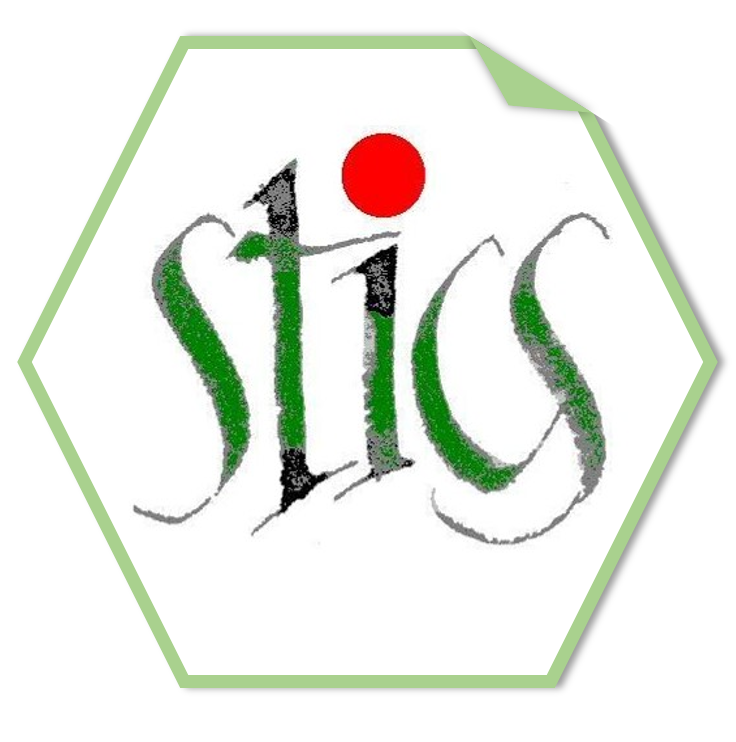

<!-- README.md is generated from README.Rmd. Please edit that file -->

# SticsRPacks <a href='https://sticsrpacks.github.io/SticsRPacks/'></a>

<!-- badges: start -->

[](https://github.com/SticsRPacks/SticsRPacks/actions)
[](https://zenodo.org/badge/latestdoi/223148621)
<!-- badges: end -->

## Overview

SticsRPacks is a set of packages that work in harmony because they share
common data representations and API design. The **SticsRPacks** package
is designed to make it easy to install and load core packages from
SticsRPacks in a single command.

If you’d like to learn how to use the SticsRPacks packages, the best
place to start are the vignettes that come along the packages, and also
available from each websites (Article sections).

> This package is heavily inspired from the tidyverse
> [package](https://github.com/tidyverse/tidyverse).

## Installation

The installation requires the devtools package. If it is not yet
installed, run first `install.packages("devtools")`.

Then, you can install the SticsRPacks packages by running:

``` r
devtools::install_github("SticsRPacks/SticsRPacks@*release")
```

## Troubleshooting

It the installation does not work:

- In case you have messages such as:

  - “cannot remove prior installation of package ‘\*\*\*\*\*’”

  or

  - API rate limit exceeded for \*\*\*\*

  please refer to
  [here](https://github.com/SticsRPacks/documentation/blob/master/github_install.md)

- otherwise, please follow the instructions given
  [here](https://github.com/SticsRPacks/SticsRPacks/issues/1#event-2864068985).

## Usage

`library(SticsRPacks)` will load the core SticsRPacks packages:

- [SticsRFiles](https://github.com/SticsRPacks/SticsRFiles), for files
  manipulation.  
- [SticsOnR](https://github.com/SticsRPacks/SticsOnR), for STICS
  simulation management.  
- [CroPlotR](https://github.com/SticsRPacks/CroPlotR), for plotting and
  statistics.  
- [CroptimizR](https://github.com/SticsRPacks/CroptimizR), for parameter
  optimization.

You also get a condensed summary of conflicts with other packages you
have loaded:

``` r
library(SticsRPacks)
#> ── Attaching packages ───────────────────────────────────── SticsRPacks 0.3.1 ──
#> ✔ SticsRFiles 1.1.2     ✔ SticsOnR    1.0.1
#> ✔ CroptimizR  0.5.1     ✔ CroPlotR    0.9.0
#> ── Conflicts ──────────────────────────────────────── SticsRPacks_conflicts() ──
#> ✖ CroptimizR::AIC()      masks stats::AIC()
#> ✖ CroptimizR::BIC()      masks stats::BIC()
#> ✖ methods::body<-()      masks base::body<-()
#> ✖ SticsOnR::is_mac()     masks SticsRFiles::is_mac()
#> ✖ SticsOnR::is_unix()    masks SticsRFiles::is_unix()
#> ✖ SticsOnR::is_windows() masks SticsRFiles::is_windows()
#> ✖ methods::kronecker()   masks base::kronecker()
```

You can see conflicts created later with `SticsRPacks_conflicts()`:

``` r
library(MASS)
SticsRPacks_conflicts()
#> ── Conflicts ──────────────────────────────────────── SticsRPacks_conflicts() ──
#> ✖ CroptimizR::AIC()      masks stats::AIC()
#> ✖ CroptimizR::BIC()      masks stats::BIC()
#> ✖ methods::body<-()      masks base::body<-()
#> ✖ SticsOnR::is_mac()     masks SticsRFiles::is_mac()
#> ✖ SticsOnR::is_unix()    masks SticsRFiles::is_unix()
#> ✖ SticsOnR::is_windows() masks SticsRFiles::is_windows()
#> ✖ methods::kronecker()   masks base::kronecker()
```

And you can check that all SticsRPacks packages are up-to-date with
`SticsRPacks_update()`:

``` r
SticsRPacks_update()
#> The following packages are out of date:
#>  * SticsRFiles (0.4.0 -> 0.4.1)
#>  * CroptimizR (0.4.1 -> 0.5)
#> Update now?
#> 
#> 1: Yes
#> 2: No
```

## Tutorial

**A tutorial is provided to learn how to use the main features of the
SticsRPacks packages!**

To run it you need to install the `learnr` package.

If you have a version of STICS more recent or equal to 9.2.0 installed
on your computer, it is recommended that you use this version to carry
out the exercises of the tutorial.

For this, an environment variable `javastics_path` must be set to the
path of the corresponding JavaSTICS folder. This can be done:

- in your R session, each time before running the tutorial, by executing
  the following command:
  `Sys.setenv(javastics_path="path_to_JavaSTICS”)`, where
  `path_to_JavaSTICS` should be replaced by the absolute path of the
  corresponding JavaSTICS folder.

or

- by defining this environment variable in your .Renviron file: edit
  this file (located in your Home directory, can be edited also using
  `usethis::edit_r_environ()`), and add a new line
  `javastics_path="path_to_JavaSTICS"`

Your R session must then be restarted in any case (in RStudio: menu
Session-\> Restart R).

Then, if you have RStudio version 1.3 or greater, click on the Tutorial
pane on the right of the RStudio window (close to Environment, History,
… panes), scroll to see `Tutorial for SticsRPacks` and click on the
button `Start Tutorial`.

Alternatively, e.g. if you have an older version of RStudio or if you
don’t have the Tutorial pane for any reason, you can run the tutorial by
running the command:
`learnr::run_tutorial("SticsRpacks", package="SticsRPacks")`

The first time it is started, the tutorial takes a few minutes to
initialize in order to download all the materials and run the solutions.
Subsequent runs do not need this steps, the tutorial will thus start
almost immediately from the second run.

**NEWS: the tutorial can now be done online, without installing
SticsRPacks: just by clicking
[here](https://mybinder.org/v2/git/https%3A%2F%2Fforgemia.inra.fr%2Fstics-formation%2Fsticsrpacks-binder.git/v0.4.0?urlpath=shiny/SticsRpacks/),
thanks to [@eric.casellas](https://forgemia.inra.fr/eric.casellas).**

## Getting help

If you have any question or suggestion or if you want to report a bug,
please do it via the GitHub
[issues](https://github.com/SticsRPacks/SticsRPacks/issues).

Thanks for that, this would greatly help us to improve this package.

## Citation

If you have used this package for a study that led to a publication or
report, please cite us. You can either use the citation tool from Github
if you used the last version, or use `citation("SticsRPacks")` from R
otherwise.

## Code of Conduct

Please note that the SticsRPacks project is released with a [Contributor
Code of
Conduct](https://github.com/SticsRPacks/.github/blob/master/CODE_OF_CONDUCT.md).
By contributing to this project, you agree to abide by its terms.
