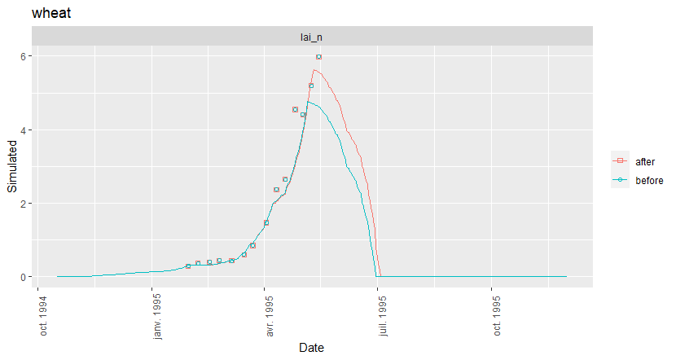

```{r setup, include=FALSE}
library(learnr)
library(SticsRPacks)
# library(gradethis)
knitr::opts_chunk$set(echo = FALSE)
tutorial_options(exercise.lines = 5)
# gradethis::gradethis_setup()

# Add checking JavaStics path

parameters = list(
  gen_help = TRUE,
  javastics = "JavaSTICS-1.41-stics-9.2",
  workspace_xml = "JavaSTICS-1.41-stics-9.2/example",
  workspace_txt = "example",
  use_default = TRUE,
  work_dir = file.path(normalizePath(dirname(tempdir()), winslash = "/"), "SticsRpacks")
)

work_dir <- parameters$work_dir
work_dir <- gsub(pattern = "\\\\", replacement="/", x=work_dir)

# Creating work_dir if needed
if (!dir.exists(work_dir)) dir.create(work_dir)

javastics <- file.path(work_dir, parameters$javastics, fsep ="/")

if (!dir.exists(javastics)) dir.create(javastics)

if(!any(grepl("JavaStics.exe",list.files(javastics)))) {
  zip_path <- file.path(work_dir,paste0(parameters$javastics,".zip"))
  system(paste0("curl -u stics_user:w10lptr6405 https://w3.avignon.inra.fr/forge/attachments/download/2482/",parameters$javastics,".zip --output ", zip_path))
  unzip(zip_path, exdir = javastics)
}

workspace_xml <- file.path(work_dir, parameters$workspace_xml, fsep ="/")
workspace_txt <- file.path(work_dir, parameters$workspace_txt, fsep ="/")

# Generating html help files, one for each function
if(parameters$gen_help) {
  help_dir <- file.path(work_dir, "SticsRFiles_help")
  if (!dir.exists(help_dir)) dir.create(help_dir)
  SticsRFiles:::static_help(pkg = "SticsRFiles", 
                            overwrite = FALSE, 
                            out_dir = help_dir)
}
```

## Introduction

**Décrire ici en 2 mots ce que font les paquets**

<div class="alert alert-danger">
  Test danger 2
</div>

<div class="alert alert-warning">
  Test warning
</div>

<div class="alert alert-info">
  Test info
</div>


Detailed documentation on the different packages can be found at:

* [https://sticsrpacks.github.io/SticsRFiles/]
* [https://sticsrpacks.github.io/SticsOnR/]
* [https://sticsrpacks.github.io/CroptimizR/]
* [https://sticsrpacks.github.io/CroPlotR/]

**Expliquer aussi comment trouver de l'aide sur les fonctions: ? + reference, ...**


## A foretaste of SticsRpacks 

### TP Stics


### A simple example

Here is a simple example use-case of an optimization of the `stamflax` parameter for a wheat crop using one situation (*i.e.* one USM).

```{r simple-example-param-estim, eval=FALSE}
usm = "wheat"

# First, import the observations and filter them:
obs = get_obs(workspace = workspace_xml, usm_name = usm)
obs_filt = filter_obs(obs, "lai_n", include = TRUE)

# Set-up the simulation environment:
wrapper_options = stics_wrapper_options(javastics_path = javastics, data_dir = workspace_xml, parallel = TRUE)
optim_options = list(nb_rep = 3, path_results = workspace_xml)

# Define the parameter to optimize and the boundary values:
param_info = list(stamflax = list(lb = 200, ub = 400))

# Generate the files for the simulation:
gen_usms_xml2txt(javastics, workspace_xml, usms_list = usm)

# Make the optimization:
optim_res = estim_param(obs_list = obs_filt,
                        model_function = stics_wrapper,
                        model_options = wrapper_options,
                        optim_options = optim_options,
                        param_info = param_info)

# Import the results before/after the simulation and plot them:
sim_after_optim = stics_wrapper(param_values = optim_res$final_values, model_options = wrapper_options)$sim_list
sim_before_optim = stics_wrapper(model_options = wrapper_options)$sim_list

plot(sim = sim_after_optim, obs = obs_filt, var = "lai_n")
```

And here is the result:

```{r}

```


## Finding names of STICS variables

Names of STICS variables can be retrieved from partial name or keywords using the `get_var_info` function of the [SticsRFiles package](https://sticsrpacks.github.io/SticsRFiles/index.html).

Here's its description as given in the R help panel (`? get_var_info`) and the [SticsRFiles package website](https://sticsrpacks.github.io/SticsRFiles/reference/get_var_info.html):

<blockquote>

```{r, results="asis"}
lines <- SticsRFiles:::get_from_help(file.path(help_dir,"get_var_info.html"))
cat( paste( lines , collapse="\n" ) )
```

</blockquote>


#### Exercises

* Find all STICS variables characterizing roots

```{r get_var_info1, exercise=TRUE}
# Insert your R code here!
```

```{r get_var_info1-hint-1}
# Use argument keyword="roots"! 
```

```{r get_var_info1-solution}
# SOLUTION:
get_var_info(keyword = "roots")
```


## Exploring the content of the JavaSTICS files 

We're going to see in this section how to retrieve information from JavaStics input files.
 
### Get usm names

The function `get_usms_list` from the [SticsRFiles package](https://sticsrpacks.github.io/SticsRFiles/index.html) returns the list of USMs included in a usms.xml file.

Here's its description as given in the R help panel (`? get_usms_list`) and on the [SticsRFiles package website](https://sticsrpacks.github.io/SticsRFiles/reference/get_usms_list.html):

<blockquote>

```{r, results="asis"}
lines <- SticsRFiles:::get_from_help(file.path(help_dir,"get_usms_list.html"))
cat( paste( lines , collapse="\n" ) )
```

</blockquote>

#### Exercises

* Get the list of USMs included in the Example workspace of the JavaStics distribution, which path is stored in the R object `workspace_xml`.

```{r get_usms_list1, exercise=TRUE}
# Insert your R code here!
```

```{r get_usms_list1-hint-1}
# Use file.path function to build full path to a file from directory names and filenames: file.path(path,filename) 
```

```{r get_usms_list1-solution}
# SOLUTION:
get_usms_list(usm_path = file.path(workspace_xml, "usms.xml"))
```

<!-- ```{r get_usms_list1-check} -->
<!-- grade_result( -->
<!--   pass_if(~identical(.result, get_usms_list(usm_path = file.path(workspace_xml, "usms.xml")))) -->
<!-- ) -->
<!-- ``` -->

* Get the list of cover-crops USMs (their name starts with `"cc_"`).

```{r get_usms_list2, exercise=TRUE}
# Insert your R code here!
```

```{r get_usms_list2-hint-1}
# The argument name is particularly useful in this case ...
```

```{r get_usms_list2-solution}
#SOLUTION:
get_usms_list(usm_path = file.path(workspace_xml, "usms.xml"), name = "cc_")
```

### Get parameters values from JavaStics input files

Parameters values included in JavaStics input files can be retrieved using the function `get_param_xml` from the [SticsRFiles package](https://sticsrpacks.github.io/SticsRFiles/index.html):

<blockquote>

```{r, results="asis"}
lines <- SticsRFiles:::get_from_help(file.path(help_dir,"get_param_xml.html"))
cat( paste( lines , collapse="\n" ) )
```

</blockquote>

#### Exercises

* Get the values of clay content after decarbonation (argi) for all soils defined in the Example workspace of the JavaStics distribution.

```{r get_param_xml1, exercise=TRUE}
# Insert your R code here!
```

```{r get_param_xml1-hint-1}
# Soils are defined in the "sols.xml" file ...
```

```{r get_param_xml1-solution}
#SOLUTION:
get_param_xml(file.path(workspace_xml,"sols.xml"), c("argi"))
```

```{r get_param_xml2-setup}
result <- get_param_xml(file.path(workspace_xml,"sols.xml"), c("argi"))
```

* Plot an histogram of these values that we stored in an R object called `result`

```{r get_param_xml2, exercise=TRUE}
# Insert your R code here!
```

```{r get_param_xml2-hint-1}
# Use hist function to plot an histogram
```

```{r get_param_xml2-hint-2}
# Be careful, result is a list: argi is stored in result$sols.xml$argi
```

```{r get_param_xml2-solution}
#SOLUTION:
hist(result$sols.xml$argi)
```

* Compute the Available Water Capacity of soil `"solmais"` in mm

```{r get_param_xml3, exercise=TRUE}
# Insert your R code here!
```

```{r get_param_xml3-hint-1}
# Equation of Available Water Capacity in mm from STICS inputs is: AWC=sum((HCCF-HMINF)*epc*DAF/10)
```

```{r get_param_xml3-hint-2}
# Use select and value arguments of get_param_xml to extract information for a given soil
```

```{r get_param_xml3-solution}
# SOLUTION:
result <- get_param_xml(file.path(workspace_xml,"sols.xml"), c("HCCF","HMINF","epc","DAF"),select="sol",value="solmais")
sum((result$sols.xml$HCCF-result$sols.xml$HMINF)*result$sols.xml$epc*result$sols.xml$DAF/10)
```

### Get weather variables

Weather variables defined in STICS input weather files can be retrieved using the function `get_climate_txt` from the [SticsRFiles package](https://sticsrpacks.github.io/SticsRFiles/index.html):

<blockquote>

```{r, results="asis"}
lines <- SticsRFiles:::get_from_help(file.path(help_dir,"get_climate_txt.html"))
cat( paste( lines , collapse="\n" ) )
```

</blockquote>

#### Exercises

* Compute the total amount of precipitation that has fallen in Auzeville in 2013 from the file `"Auzeville.2013"` of the Javastics Example workspace.

```{r get_climate_txt1, exercise=TRUE}
# Insert your R code here!
```

```{r get_climate_txt1-hint-1}
# Precipitation is stored in the column named ttrr 
```

```{r get_climate_txt1-solution}
#SOLUTION:
result <- get_climate_txt(dirpath=workspace_xml,filename="Auzeville.2013")
sum(result$ttrr)
```

* Compute the amount of precipitation that has fallen between dates "2013-03-21" and "2013-09-20".

```{r get_climate_txt2, exercise=TRUE}
# Insert your R code here!
```

```{r get_climate_txt2-hint-1}
# Use dplyr::filter(result,Date>"2013-03-21", Date<"2013-09-20") to filter the results wrt the Dates.
```

```{r get_climate_txt2-solution}
#SOLUTION:
result <- get_climate_txt(dirpath=workspace_xml,filename="Auzeville.2013")
filtered_result <- dplyr::filter(result,Date>"2013-03-21", Date<"2013-09-20")
sum(filtered_result$ttrr)
```


## Running simulations from R

Let see now how to run STICS simulations directly from R using the function `run_javaStics` from the [SticsOnR package](https://sticsrpacks.github.io/SticsOnR/index.html).

From now on we will no longer display function help in the tutorial. Use `? function_name` or explore the packages websites (in particular the Reference tab) to display it.

### Exercises

* Run all the USMs defined in the Example workspace of the JavaStics distribution. Path to JavaStics is stored in the `javastics` R object.

```{r run_javaStics1, exercise=TRUE}
# Insert your R code here!
```


```{r run_javaStics1-hint-1}
# No need to use the usms_list argument!
```

```{r run_javaStics1-solution}
# SOLUTION:
run_javastics(javastics_path=javastics,  workspace_path = workspace_xml)
```

* Run only the USMs banana and Turmeric.

```{r run_javaStics2, exercise=TRUE}
# Insert your R code here!
```


```{r run_javaStics2-hint-1}
# Use the usms_list argument!
```

```{r run_javaStics2-solution}
# SOLUTION:
run_javastics(javastics_path=javastics,  workspace_path = workspace_xml, usms_list = c("banana","Turmeric"))
```

<div class="alert alert-info">
  See also: `gen_varmod` function to modify var.mod file in case STICS does not simulate the variables you are interested in.
</div>


## Exploring and Evaluating the Stics results

<!-- PATRICE -->

### Getting simulations results

In order to get simulation results to R from a Stics workspace, the `get_sim` function is to be used with some options allowing to filter data against usm names, output variables for example. Check the function help before trying to use it. Check also where the simulations files are stored after running the model in the previous section.


<!-- #### Exercises -->

* Get all outputs from the workspace

```{r get_sim1, exercise=TRUE}
# Insert your R code here! 

```
```{r get_sim1-hint-1}
# Path of the results is stored in the workspace_xml object
```

```{r get_sim1-solution}
get_sim(workspace = workspace_xml)
```

* Get outputs for USMs named : banana, Turmeric

```{r get_sim2, exercise=TRUE}
# Insert your R code here! 
```

```{r get_sim2-hint-1}
# The argument usm_name is particularly useful in this case ...
```

```{r get_sim2-solution}
# SOLUTION
get_sim(workspace = workspace_xml, usm_name = c("banana","Turmeric"))
```

* Get outputs for the USMs of your choice other than banana, Turmeric

```{r get_sim3, exercise=TRUE}
# Insert your R code here!

```

```{r get_sim3-hint-1}
# Get the usms names list before choosing ...
```

```{r get_sim3-hint-2}
# The function get_usms_list will be usefull
```

```{r get_sim3-solution}
# SOLUTION
get_sim(workspace = workspace_xml, usm_name = c("wheat", "maize"))
```

* Get simulations outputs and store them in a `results` object using the variable `lai(n)` for the USMs named `wheat` and `maize`

```{r get_sim4, exercise=TRUE}
# Insert your R code here!
```

```{r get_sim4-hint-1}
# Use the argument var_list for specifying which variable(s) to select ...
```

```{r get_sim4-solution}
# SOLUTION
results <- get_sim(workspace = workspace_xml, usm_name = c("wheat", "maize"),
                   var_list = "lai(n)")
```

### Plotting simulations results

<div class="alert alert-info">
Be carefull that for the moment, the names of the Stics variables which are to be used for plotting are not exactly the same as the real ones.
In fact, the plotting functions use a specfic syntax for variables names which contain braces. For exemple, `lai_n` instead of `lai(n)`.
</div>

<!-- #### Exercises -->

* Plotting simulations dynamics of the variable `lai(n)` and `masec` for `wheat`
  * Independently

```{r plot_sim1, exercise=TRUE}
# Insert your R code here!
```

```{r plot_sim1-hint-1}
# get output first, perhaps variable names are not correct !
```

```{r plot_sim1-solution}
# SOLUTION
results <- get_sim(workspace = workspace_xml, usm_name = "wheat",
                   var_list = c("lai(n)", "masec(n)"))
# separated
plot(results, var = "lai_n")
plot(results, var = "masec_n")
# on the same output graph
plot(results, var = c("lai_n","masec_n"))
```

  * On the same plot

```{r plot_sim2, exercise=TRUE}
# Insert your R code here!
```

```{r plot_sim2-hint-1}
# give variable names not as var_list argument value but as a overlap one ...
# check the function help for overlap content structure !
```
```{r plot_sim2-hint-2}
# try using : overlap = list(list("lai_n","masec_n"))
```

```{r plot_sim2-solution}
# SOLUTION
results <- get_sim(workspace = workspace_xml, usm_name = "wheat",
                   var_list = c("lai(n)", "masec(n)"))
plot(results, overlap = list(list("lai_n","masec_n")))
```

### Evaluating simulations results

Evaluation of simulation results is performed using observation data with the help of plotting dynamics, scatter graphs and calculating several statistics criteria. Observed data can be loaded by using the `get_obs` function and they are given as inputs to functions which are going to be tested here after. 


#### Getting observation data

<!-- Voir ou le mettre, ou alors l'integrer dans les manips ? -->

<div class="alert alert-info">
By default, each element (i.e. data.frame per USM) of the returned object by `get_obs()` contains a `Plant` column in which are stored either `"plant_1"` or `"plant_2"` indicating respectively a main crop or an intercrop. If the `usms.xml` is given to the function, plant file names are set in the `Plant` column. 
</div>


  * Get all the observation data

```{r get_obs1, exercise=TRUE}
# Insert your R code here! 

```
```{r get_obs1-hint-1}
# Path of the observation files is the same as simulations outputs
```

```{r get_obs1-solution}
# SOLUTION
get_obs(workspace = workspace_xml)
```

  * Get observations for USMs named : `wheat` and `maize`


```{r get_obs2, exercise=TRUE}
# Insert your R code here! 

```
```{r get_obs2-hint-1}
# Use the same syntax as for the get_sim function
```

```{r get_obs2-solution}
# SOLUTION
get_obs(workspace = workspace_xml, usm_name = c("wheat", "maize"))
```

   * Try to get observations for specific variables and combinations with USMs 

```{r get_obs3, exercise=TRUE}
# Insert your R code here! 
```


####	Dynamics plots using observation data

See previous plotting exercises and add observation data in them.

```{r plot_simobs1, exercise=TRUE}
# Insert your R code here!
```

```{r plot_simobs1-hint-1}
# See previous exercises for dynamics plotting
# check that you already stored observations data
```

```{r plot_simobs1-solution}
# SOLUTION
results <- get_sim(workspace = workspace_xml, usm_name = c("wheat", "maize"))
observations <- get_obs(workspace = workspace_xml, usm_name = c("wheat", "maize"))
plot(results, var = c("lai_n","masec_n"), obs = observations)

```
<!-- with overlap
# ne fonctionne pas
#plot(results, overlap = list(list("lai_n","masec_n")), obs = observations)
-->

####	Basic scatter plot

Scatter plots are used for displaying comparison between simulated variables againts observations. They can be produced using the same `plot` function as for dynamics plots, with only changing the plot type.

```{r plot_simobs2, exercise=TRUE}
# Insert your R code here!
```

```{r plot_simobs2-hint-1}
# See help for understanding which input function argument must be changed
```

```{r plot_simobs2-solution}
# SOLUTION
results <- get_sim(workspace = workspace_xml, usm_name = c("wheat", "maize"))
observations <- get_obs(workspace = workspace_xml, usm_name = c("wheat", "maize"))
plot(results, var = c("lai_n","masec_n"), obs = observations, type = "scatter")

```

####	Customized scatter plot using symbols

* Using specific symbols for USMS

```{r plot_simobs3, exercise=TRUE}
# Insert your R code here!
```

```{r plot_simobs3-hint-1}
# See help for understanding which input function argument must be changed
```

```{r plot_simobs3-solution}
# SOLUTION
results <- get_sim(workspace = workspace_xml, usm_name = c("wheat", "maize"))
observations <- get_obs(workspace = workspace_xml, usm_name = c("wheat", "maize"))
plot(results, var = c("lai_n","masec_n"), obs = observations, type = "scatter", shape_sit = "symbol")

```

* Using specific symbols for USMS groups

```{r plot_simobs4, exercise=TRUE}
# Insert your R code here!
```

```{r plot_simobs4-hint-1}
# You must get data and observations for more than 2 USMs for defining groups ... and see how to define groups and select the right shape_sit value 
```

```{r plot_simobs4-solution}
# SOLUTION
usms <- c("wheat","DurumWheat", "maize", "sorghum")
groups <- list(list("wheat","DurumWheat"), list("maize", "sorghum"))
results <- get_sim(workspace = workspace_xml, usm_name = usms)
observations <- get_obs(workspace = workspace_xml, usm_name = usms)
plot(results, var = c("lai_n","masec_n"), obs = observations, type = "scatter", shape_sit = "group", situation_group = groups)

```

<!-- NOTES bug
* avec 1 groupe
plot(results, var = c("lai_n","masec_n"), obs = observations, type = "scatter", shape_sit = "group", situation_group = list(list("wheat", "maize")))
les points associés au groupe mm; couleur (enfin je suppose, pas controle du nb points) légende NA

* 2 groupes
plot(results, var = c("lai_n","masec_n"), obs = observations, type = "scatter", shape_sit = "group", situation_group = list(list("wheat","DurumWheat"), list("maize", "sorghum")))
-->

####	Statistics and associated graphs

For that purpose the `summary()` function will be used for producing statistical criteria for simulations and observations, and the summary results will be used for producing plots with the `plot()` function.

In this section only one simulation data set is used for calculating statistics and plotting them. For seeing how to use these functions for 2 sets of simulations in order to compare model versions see online documentation on [CroPlotR site](https://sticsrpacks.github.io/CroPlotR/#223-statistics-plot). 

A usm list containing for example `wheat`,`DurumWheat`, `maize`, `sorghum` may be used and 2 variables will be selected for statistics calculation and plots, `lai_n` and `masec_n`


##### Statistics criteria

  * For all USMs
  
```{r stat_simobs1, exercise=TRUE}
# Insert your R code here!
```

```{r stat_simobs1-hint-1}
# Only simulations and observations are needed
```    

```{r stat_simobs1-solution}
# SOLUTION
usms <- c("wheat","DurumWheat", "maize", "sorghum")
results <- get_sim(workspace = workspace_xml, usm_name = usms, var = c("lai_n","masec_n"))
observations <- get_obs(workspace = workspace_xml, usm_name = usms, var = c("lai_n","masec_n"))

summary(results, obs = observations)

```

* For individual USMs

```{r stat_simobs2, exercise=TRUE}
# Insert your R code here!
```

```{r stat_simobs2-hint-1}
# use all_situations argument for that
```

```{r stat_simobs2-solution}
# SOLUTION
usms <- c("wheat","DurumWheat", "maize", "sorghum")
results <- get_sim(workspace = workspace_xml, usm_name = usms, var = c("lai_n","masec_n"))
observations <- get_obs(workspace = workspace_xml, usm_name = usms, var = c("lai_n","masec_n"))

summary(results, obs = observations, all_situations = FALSE)

```

<!-- note
la premiere colonne est perturbante Version 1
si 1 jeu de simulation: superflue !!
utile en cas de comparaison de 2 jeu de simulations

Si 2 jeux: plutôt que le nom de colonne == group, simu (pour les graphes scatter group == groupes d'usms !)
-->

<!-- !!!!! voir pour ajouter un cas ou on nomme le jeu de sim
pour retrouver le nom dans la colonne "group"
-->


##### Statistics graphs

For this use, one must limitate the number of variables to use and also the number of criteria to be plotted.    
As for dynamics plots, the `plot` function will be used to render plot about statistical criteria.
    
For this purpose, the `R2` and `nRMSE` criteria will be used.

<!-- Remarque
- Preciser les limites de la fonction (nb c)
- amelioration fonction: gerer le nombre de plots en fonction du nombre de criteres et de variables
-->

  * For all USMs

```{r stat_simobs3, exercise=TRUE}
# Insert your R code here!
```

```{r stat_simobs3-hint-1}
# the object returned by the call of the summary function is to be used
```

```{r stat_simobs3-solution}
# SOLUTION
usms <- c("wheat","DurumWheat", "maize", "sorghum")
results <- get_sim(workspace = workspace_xml, usm_name = usms, var = c("lai_n","masec_n"))
observations <- get_obs(workspace = workspace_xml, usm_name = usms, var = c("lai_n","masec_n"))

summ <- summary(results, obs = observations, stat = c("R2","nRMSE"))

plot(summ, title = "for all USMs")

```

  * For individual USMs

> USMs may be distinguished using colors and a legend 

```{r stat_simobs4, exercise=TRUE}
# Insert your R code here!
```

```{r stat_simobs4-hint-1}
# all_situations argument is usefull for that
```

```{r stat_simobs4-solution}
# SOLUTION
usms <- c("wheat","DurumWheat", "maize", "sorghum")
results <- get_sim(workspace = workspace_xml, usm_name = usms, var = c("lai_n","masec_n"))
observations <- get_obs(workspace = workspace_xml, usm_name = usms, var = c("lai_n","masec_n"))

summ <- summary(results, obs = observations, all_situations = FALSE, stat = c("R2","nRMSE"))

plot(summ, title = "for each USM")
  
```

> Or USMs names may be used along x axis

```{r stat_simobs5, exercise=TRUE}
# Insert your R code here!
```

```{r stat_simobs5-hint-1}
# xvar argument must be used for that !
```

```{r stat_simobs5-solution}
# SOLUTION
usms <- c("wheat","DurumWheat", "maize", "sorghum")
results <- get_sim(workspace = workspace_xml, usm_name = usms, var = c("lai_n","masec_n"))
observations <- get_obs(workspace = workspace_xml, usm_name = usms, var = c("lai_n","masec_n"))

summ <- summary(results, obs = observations, all_situations = FALSE, stat = c("R2","nRMSE"))

plot(summ, xvar = "situation", title= "USM names as X")
  
```


## Advanced use{#advanced-use}

You have learned so far how to use very useful but quite basic features of SticsRpacks packages.

Let's go now deeper into the packages functionalities.

## Generating STICS input Files

The different types of STICS input files can be generated using the [SticsRFiles package](https://sticsrpacks.github.io/SticsRFiles/index.html). 


### Generating JavaStics input files

The JavaStics XML input files can be generated from R using functions of the [SticsRFiles package](https://sticsrpacks.github.io/SticsRFiles/index.html). JavaStics Input files (XML format) 

#### Exercises

```{r gen_xml-1, echo=FALSE}
question("What is the name of the SticsRFiles function for generating a usms.xml file?",
  answer("gen_usms_xml2txt"),
  answer("get_usms_files"),
  answer("gen_usms_xml", correct = TRUE),
  answer("gen_usms"),
  incorrect = "Look at the Reference tab of the SticsRFiles website...",
  random_answer_order = TRUE,
  allow_retry = TRUE)
```


```{r gen_xml-2, echo=FALSE}
question("From which type of file the usms.xml file can be generated using this function?",
  answer("csv", correct=TRUE),
  answer("word"),
  answer("excel", correct = TRUE),
  answer("XML"),
  correct = "Great!",
  incorrect = "Look at the vignette \"Generating Stics XML files from tabulated data\" of the SticsRFiles website (Article tab)...",
  random_answer_order = TRUE,
  allow_retry = TRUE)
```


```{r gen_xml-3, echo=FALSE}
question("Which type of JavaStics files can not yet be generated using the gen_*_xml functions?",
  answer("Soil files"),
  answer("Weather data files", correct=TRUE),
  answer("General parameter files", correct = TRUE),
  answer("Technical files"),
  answer("Weather station files"),
  correct = "Incredible!",
  incorrect = "Look at the vignette \"Generating Stics XML files from tabulated data\" of the SticsRFiles website (Article tab)...",
  random_answer_order = TRUE,
  allow_retry = TRUE)
```

<div class="alert alert-info">
See also:

  * Look at the vignette [Generating Stics XML files from tabulated data](https://sticsrpacks.github.io/SticsRFiles/articles/Generating_Stics_XML_files.html) for more details on how to use these functions!
  * STICS input files (txt format) can be generated from a SticsRFiles R function: see section  below "Creating the text files".
</div>


### Generating observation files 

Observation files can be generated from a data.frame using the function `gen_obs` of the [SticsRFiles package](https://sticsrpacks.github.io/SticsRFiles/index.html).

They are not used by the STICS model but can be used to plot comparison between observed and simulated variables and to optimize STICS parameters both in JavaStics and in [CroPlotR](https://sticsrpacks.github.io/CroPlotR/index.html) and [CroptimizR](https://sticsrpacks.github.io/CroptimizR/index.html) packages.
 
#### Exercises

* Generate observation files from the data stored in the `df` data.frame using the `gen_obs` function, check the files are created on your computer and check their content using the `get_obs` function.

```{r gen_obs, exercise=TRUE}
df <- data.frame(usm_name=c("usm1","usm1","usm2"), ian=c(2020,2021,2021), mo=c(12,7,7), jo=c(25,27,20),jul=c(359,573,566),`lai(n)`=c(0.5,4.5,4.2), mafruit=c(NA,6.5,6.1))

# Insert your R code here!
```

```{r gen_obs-hint-1}
# Use the out_path argument of get_obs if you want to specify the path of the folder where the obs files will be created.
# By default they are created in the current working directory of the R process (given by getwd()).
```

```{r gen_obs-hint-2}
# Use the workspace argument of get_obs to specify the path to the folder containing the observation files.
# if you did not use  the out_path argument in gen_obs, then use workspace = getwd() in get_obs.
```

```{r gen_obs-solution}
#SOLUTION:
gen_obs(obs_table = df)
get_obs(workspace = getwd())
```

<div class="alert alert-info">
Note that a subset of the observation files defined in the observation data.frame can be generated using the usms_list argument of gen_obs.
</div>
 
## Modifying JavaStics input files

[SticsRFiles](https://sticsrpacks.github.io/SticsRFiles/index.html) package also provides facilities for modifying JavaStics input files from R.

#### Exercises

```{r set_param_xml-1, echo=FALSE}
question("What is the name of the SticsRFiles function for modifying JavaStics Input files (XML format)?",
  answer("set_param_xml", correct = TRUE), 
  answer("set_param_txt"),
  answer("gen_usms_xml"),
  answer("gen_usms"),
  incorrect = "Look at the Reference tab of the SticsRFiles website...",
  random_answer_order = TRUE,
  allow_retry = TRUE)
```

* Check the values of the nitrification code (`codenitrif`) for the soils defined in the `sols.xml` file of the JavaStics distribution example workspace (path to the JavaStics distribution example workspace is stored in the R object `workspace_xml`)
  
```{r set_param_xml-2, exercise=TRUE}
# Insert your R code here!
```

```{r set_param_xml-2-hint-1}
# Use function get_param_xml
```

```{r set_param_xml-2-solution}
# SOLUTION:
get_param_xml(xml_file=file.path(workspace_xml,"sols.xml"),  
              param_name="codenitrif")
```
  
* Then, generate in the JavaStics distribution example workspace a new soil file called `sols_new.xml` for which all nitrification codes are set to 1 and check their values using the `get_param_xml` function.

```{r set_param_xml-3, exercise=TRUE}
# Insert your R code here!
```

```{r set_param_xml-3-hint-1}
# Use function set_param_xml
```

```{r set_param_xml-3-solution}
# SOLUTION:
set_param_xml(xml_file=file.path(workspace_xml,"sols.xml"),  
              param_name="codenitrif", param_value=1, out_path=file.path(workspace_xml,"sols_new.xml"))
get_param_xml(xml_file=file.path(workspace_xml,"sols_new.xml"),  
              param_name="codenitrif")
```


**SAMUEL: AJOUTER UN SEE ALSO POUR MODIF DES TXT ???** 
 

 
## Running simulations from R using stics_wrapper

### The need of a wrapper

We saw earlier how to make a simulation using `run_javastics()`. This function simply call javastics from the command line to make simulations, which does the same as running an usm by opening the javastics user interface, but from R. 

You are probably familiar with the xml files used as inputs for javastics (*e.g.* `sols.xml` or `usms.xml`). These files list all the parameter values for one or several usms, with potentially several soils, management practices and climate. Then when we run a usm, javastics reads the parameters values from the xml files, and writes new text files with only the values associated to this particular usm. Then it calls the stics model that reads those text files, make the simulation, and writes the outputs. 

So when we run a usm from javastics we have four different steps:

1. javastics reads the parameter values for the usm from the xml files
1. javastics writes text files with the parameter values that only describe this usm
1. javastics calls the stics model (*i.e* the stics executable)
1. the stics model reads the parameter values from the text files, make a simulation, and writes the output files (*i.e.* `mod_bXXX.sti` and `mod_sXXX.sti`)

This method is simpler for the user because it hides the technical details, but it has some downsides: it is slow because we have to create the text files each time we make a simulation, and we cannot parallelize the simulations because we share the same text files.

But no worries, SticsRPacks provides a solution to this!

Instead of creating the text files one usm at a time, we create them for all usms once into one folder for each, and then we directly call the stics model (*i.e* without using javastics) on these files. Using this method we are now able to run the simulations way faster, and in parallel! 

So how do we do that? Well, we use three steps:

- create the text files (`gen_usms_xml2txt()`)
- set-up our modeling environment (`stics_wrapper_options()`)
- run the simulations and import the results (`stics_wrapper()`)

### Creating the text files

The first step is to create the text files for each usms in a separate directory. To do so, we use `gen_usms_xml2txt()`.

This tutorial stores a javastics installation in the `javastics` variable, and an example workspace in the `workspace_xml` variable.

Before generating the text files, we will first restrain the number of variables we want stics to output using `gen_varmod`.

> Use `gen_varmod` to tell stics we only want "lai(n)", "masec(n)" and "QNplante"

```{r gen_varmod, exercise=TRUE}
# Generate text files for usms "wheat" and "banana" and "soybean"
```

```{r gen_varmod-hint-1}
# Use `javastics_path = javastics` and `workspace_path = workspace_xml`
```

```{r gen_varmod-solution}
#SOLUTION:
gen_varmod(workspace_xml, var_names = c("lai(n)", "masec(n)", "QNplante"))
```

It is generally useful to pre-filter the variables to avoid filtering the variables for the wrapper, the plots and the statistics.  

Now we can generate our text files. 

> Use `gen_usms_xml2txt()` with those variables to generate the text files for the usms "wheat", "banana" and "soybean":

```{r gen_usms_xml2txt, exercise=TRUE}
# Generate text files for usms "wheat" and "banana" and "soybean"
```

```{r gen_usms_xml2txt-hint-1}
# Use `javastics_path = javastics` and `workspace_path = workspace_xml`
```

```{r gen_usms_xml2txt-solution}
#SOLUTION:
gen_usms_xml2txt(javastics, workspace_xml, usms_list = c("wheat","banana","soybean"))
```

### Setting-up the modeling environment

Before running the simulations using stics, we have to define some information about our modeling environment. This is done using `stics_wrapper_options()`. This function helps us define where is our installation of javastics, which stics executable to use (*e.g.* if you are using an executable from a research branch), which usms to simulate, etc...

Use `stics_wrapper_options()` to set-up our modeling environment using a parallel computation over the usms:

```{r stics_wrapper_options1, exercise=TRUE}
# Set-up the modeling environment
```

```{r stics_wrapper_options1-hint-1}
# Use `javastics_path = javastics` and `data_dir = workspace_xml`
```

```{r stics_wrapper_options1-solution}
#SOLUTION:
stics_wrapper_options(javastics_path = javastics, data_dir = workspace_xml, parallel = TRUE)
```

### Running the simulations

Now everything is set-up to make our simulations! The model options we will use here are stored in the `wrapper_options` object with the options we just set up in the previous section. 

```{r prepare-wrapper, echo=FALSE}
wrapper_options = stics_wrapper_options(javastics_path = javastics, data_dir = workspace_xml, parallel = TRUE)
```

<!-- Here is its output: -->
<!-- ```{r wrapper_options_print, exercise.setup = "prepare-wrapper"} -->
<!-- wrapper_options -->
<!-- ``` -->

Now use `stics_wrapper()` to simulate the usm "wheat" only (not "banana" and "soybean") using the model options stored in `wrapper_options`, and return the leaf area index and the above-ground biomass:

```{r stics_wrapper1, exercise=TRUE, exercise.setup = "prepare-wrapper"}
# Simulate "wheat"
```

```{r stics_wrapper1-hint-1}
# The sit_names argument is used to choose the usms to simulate.
```

```{r stics_wrapper1-hint-2}
# Use get_var_info() to search for a variable name
```

```{r stics_wrapper1-solution, exercise.setup = "prepare-wrapper"}
#SOLUTION:
stics_wrapper(model_options = wrapper_options, sit_names = "wheat", var_names = c("lai(n)", "masec(n)"))
```

### Parameter forcing

Sometimes it is useful to compare the outputs of the model with a different value for one or several parameters to better understand its impact or check if it is used. 

`stics_wrapper()` provides an easy way to do so with the `param_values` argument. This argument is given as a named vector.

> Make a simulation on the "wheat" usm and output just the lai, but this time with `dlaimax = 0.005` and `durvieF = 80`:

```{r stics_wrapper2, exercise=TRUE, exercise.setup = "prepare-wrapper"}
# Insert your R code here!
```

```{r stics_wrapper2-hint-1}
# `param_values` is given as a named vector, e.g. c("bdens" = 5, "hautmax" = 1.1)
```

```{r stics_wrapper2-solution, exercise.setup = "prepare-wrapper"}
#SOLUTION:
stics_wrapper(model_options = wrapper_options, sit_names = "wheat", var_names = "lai(n)", param_values = c("dlaimax" = 0.005, "durvieF" = 80))
```

### Plot the comparison

Now we can plot the output of the two simulations using `plot()` and adding the simulation objects as arguments (optionally named). The results of both simulations are accessible in the `res1` and `res2` objects. The results of the simulations are stored in the `sim_list` field of each object. For example to get the results of the simulation for `res1`, we would do: `res1$sim_list`. 

```{r prepare-wrapper-plot, echo=FALSE}
wrapper_options = stics_wrapper_options(javastics_path = javastics, data_dir = workspace_xml, parallel = TRUE)

res1 = stics_wrapper(model_options = wrapper_options, sit_names = "wheat", var_names = c("lai_n", "masec_n"))
res2 = stics_wrapper(model_options = wrapper_options, sit_names = "wheat", var_names = "lai_n", param_values = c("dlaimax" = 0.005, "durvieF" = 80))
```

Then, to plot a simulation result, we would do:

```{r stics_wrapperplot, exercise=TRUE, exercise.setup = "prepare-wrapper-plot"}
# Execute the code below to create a plot of the results:
plot(res1$sim_list)
```

It is also possible to compare two simulations by listing them as arguments to the function one after the other.

> Plot the outputs of both simulations:

```{r stics_wrapper3, exercise=TRUE, exercise.setup = "prepare-wrapper-plot"}
# Insert your R code here!
```

```{r stics_wrapper3-hint-1}
# The simulation results can be listed one after the other in `plot()` for comparison
```

```{r stics_wrapper3-solution, exercise.setup = "prepare-wrapper-plot"}
#SOLUTION:
plot(res1$sim_list,res2$sim_list)
```

<div class="alert alert-info">
  Only the `lai` variable was requested on the second simulation, that's why there is only the first simulation for masec.
</div>

We can also name the simulations in our plot by naming them when passed as arguments to `plot()`.

> Plot the outputs of both simulations, and name the first simulation "original" and the second simulation "dlaimax=0.005, durvieF=80":

```{r stics_wrapper4, exercise=TRUE, exercise.setup = "prepare-wrapper-plot"}
# Insert your R code here!
```

```{r stics_wrapper4-hint-1}
# Name the arguments of the plot function, e.g. plot("sim1" = res1) would name the simulation "sim1" (but would not output it on the plot because there is only one)
```

```{r stics_wrapper4-solution, exercise.setup = "prepare-wrapper-plot"}
#SOLUTION:
plot("original" = res1$sim_list,"dlaimax=0.005, durvieF=80" = res2$sim_list)
```

## Estimating parameters

### Workflow

Model calibration is an important part of most modeling work, but it can be complex and cumbersome. SticsRPacks provides a nice, standardized and easy way to estimate the values of parameters using observations: `estim_param()`.

The workflow for parameter estimation is made using several steps:

- Modeling environment set-up (`stics_wrapper_options()`). `estim_param()` uses `stics_wrapper()` under the hood to run each simulation, so we must set-up our modeling environment first as we saw before. 
- Import the observations for each usm (`get_obs()` + `filter_obs()`).
- Choose the parameter(s) to optimize and their boundary values.
- set-up options for the optimization method (see other section, not presented in this one for simplicity).
- run the parameter optimization (`optim_options`).

```{r prepare-param-estim}
wrapper_options = stics_wrapper_options(javastics_path = javastics, data_dir = workspace_xml, parallel = TRUE)

obs = get_obs(workspace = workspace_xml, usm_name = "wheat")
obs_filt = filter_obs(obs, "lai_n", include = TRUE)

param_info = list(laicomp = list(lb = 0.1, ub = 1.0))

optim_options = list(nb_rep = 3, maxeval = 500, xtol_rel = 1e-03, path_results = workspace_xml, ranseed = 1234)
```

### Modelling environment

We will simply re-use the modeling environment from the previous exercise: `wrapper_options`. This is how we did it:

```r
wrapper_options = stics_wrapper_options(javastics_path = javastics, data_dir = workspace_xml, parallel = TRUE)
```

### Observations

> Import the observations for the "wheat" usm, and put it in an object called `obs`:

```{r estim_param_obs1, exercise=TRUE, exercise.setup = "prepare-param-estim"}
# Insert your R code here!
```

```{r estim_param_obs1-hint-1}
# Use `get_obs()`, workspace_xml is the workspace.
```

```{r estim_param_obs1-solution}
#SOLUTION:
obs = get_obs(workspace = workspace_xml, usm_name = "wheat")
```

> Filter the observations to get only the lai using `filter_obs()`, and put it in an object called `obs_filt`:

```{r estim_param_obs2, exercise=TRUE, exercise.setup = "prepare-param-estim"}
# Insert your R code here!
```

```{r estim_param_obs2-hint-1}
# Use `get_obs()`, workspace_xml is the workspace.
```

```{r estim_param_obs2-solution}
#SOLUTION:
obs_filt = filter_obs(obs, "lai_n", include = TRUE)
```

### Optimization algorithm parameters 

The optimization algorithm available in Croptimizer have some parameters too. For example the simplex method has the following:

- `nb_rep`: Number of times the minimization process is done, each time starting with a different set of initial
parameters values. This one is used to control whether our initial values impact our resulting optimized value or not. The more is better, but the whole optimization process is repeated `nb_rep` so it takes more and more time.
- `maxeval`: Maximum number of evaluations of the minimized criteria. That is to say the algorithm is stopped if it did not converge to a value after `maxeval` runs.
- `xtol_rel`: Tolerance criterion between two iterations, *i.e.* stop the algorithm when an optimization step (or an estimate of the optimum) changes every parameter by less than xtol_rel multiplied by the absolute value of the parameter.
- `path_results`: path to the directory on which the results will be written (graph and .Rdata)
- `ranseed`: set the random seed so that each execution give the same results. If you want full randomization, don't set it.

Only `path_results` is mandatory, all the others have default values.

<div class="alert alert-note">
More information can be found on the CroptimizR vignettes, e.g. [here](https://sticsrpacks.github.io/CroptimizR/articles/Parameter_estimation_simple_case.html).
</div>

These parameters are passed to `estim_param` as a named list.

> Make a named list to set values for these parameters and put the results in an object named `optim_options`. We require 3 repetitions (to make it quick). You can use any directory to store the results. If you don't particularly care where to put them, you can put them in `workspace_xml`.

```{r estim_param_options, exercise=TRUE}
# Insert your R code here!
```

```{r estim_param_options-hint-1}
# A name list is constructed like so: list(name1 = value1, name2 = value2)
```

```{r estim_param_options-solution}
#SOLUTION:
optim_options = list(nb_rep = 3, path_results = workspace_xml)
```

### Choose parameter

We have to choose which parameter will be optimized, and what are their respective boundary values. To do so, we define a list of list for each parameter like so: 

```r
param_info = list()
param_info$dlaimax = list(lb = 0.0005, ub = 0.0025)
param_info$durvieF = list(lb = 100, ub = 450)
```

<div class="alert alert-note">
  You can get more information about parameters using `get_param_info`.
</div>

Let's try to optimise the value of the `laicomp` parameter. 

> Create the parameter list for `laicomp` and name it `param_info`.

```{r estim_param_param, exercise=TRUE}
# Insert your R code here!
```

```{r estim_param_param-hint-1}
# You can use 0.1 and 1.0 for boundary values
```

```{r estim_param_param-solution}
#SOLUTION:
# param_info = list(laicomp = list(lb = 0.1, ub = 1.0))
param_info = list(lb = c(laicomp = 0.1), ub = c(laicomp = 1.0))
```

### Optimization

Now that we defined all information we needed, we can use `estim_param()` to make the optimization. 

As a reminder, here's the objects we previously defined:

- `obs_filt`: the observations of the objective variable  
- `stics_wrapper`: this is the wrapper function for stics
- `wrapper_options`: the options passed to `stics_wrapper`
- `optim_options`: the parameters for the optimization method 
- `param_info`: the parameter(s) names and boundary values

> Now estimate the value of `laicomp` using `estim_param()` and the previous objects we defined, and put the results in an object called `optim_res`.

```{r estim_param2, exercise=TRUE, exercise.setup = "prepare-param-estim"}
# Insert your R code here!
```

```{r estim_param2-hint-1}
# Read the documentation of estim_param() and associate the aforementioned objects to the corresponding arguments.
```

```{r estim_param2-solution}
#SOLUTION:
optim_res = estim_param(obs_list = obs_filt,
                        model_function = stics_wrapper,
                        model_options = wrapper_options,
                        optim_options = optim_options,
                        param_info = param_info)
```

<div class="alert alert-note">
The optimization process can take a while. Time to drink a ☕ maybe! 

If you don't want to wait for the optimization process, we got you covered. You 
can still continue to the next exercises because we cached the output for you.

If you didn't do the previous exercises about generating stics text files, you might 
want to execute `gen_usms_xml2txt` before `estim_param` like so:

```r
gen_usms_xml2txt(javastics, workspace_xml, usms_list = c("wheat","banana","soybean"))
```
</div>

```{r prepare-param-estim-out}
load(file = system.file("extdata/optim_results.Rdata", package = "SticsRPacks"))
optim_res = res
rm(res)
wrapper_options = stics_wrapper_options(javastics_path = javastics, data_dir = workspace_xml, parallel = TRUE)
obs_filt = filter_obs(get_obs(workspace = workspace_xml, usm_name = "wheat"), "lai_n", include = TRUE)
sim_after_optim = stics_wrapper(param_values = optim_res$final_values, model_options = wrapper_options)$sim_list
gen_usms_xml2txt(javastics, workspace_xml, usms_list = c("wheat","banana","soybean"))
sim_before_optim = stics_wrapper(model_options = wrapper_options)$sim_list
```

### Plots

Now that our parameter value is optimized, we can re-run the model with this value to check the results.
To do so, we call again `stics_wrapper` with the optimized value passed as argument.

> Use `stics_wrapper` to make a new simulation with our optimized value, and put only the results (not the errors) in an object called `sim_after_optim` (see documentation for the outputs of `stics_wrapper`.

```{r estim_param3, exercise=TRUE, exercise.setup = "prepare-param-estim-out"}
# Insert your R code here!
```

```{r estim_param3-hint-1}
# Read the documentation of stics_wrapper() and use the `param_values` argument along with the resulting optimized value stored in `optim_res$final_values`.
```

```{r estim_param3-hint-2}
# stics_wrapper() returns a list of two:
# - sim_list for the results
# - error for indications on errors 
# We need only the results in our object `sim_after_optim`.
```

```{r estim_param3-solution}
#SOLUTION:
sim_after_optim = stics_wrapper(param_values = optim_res$final_values, model_options = wrapper_options)$sim_list
```

Now we can plot the output using `plot()`.

> Use `plot()` to make a dynamic plot of the simulations along with the observations (`obs_filt`) for the `lai_n` variable.

```{r estim_param4, exercise=TRUE, exercise.setup = "prepare-param-estim-out"}
# Insert your R code here!
```

```{r estim_param4-hint-1}
# Read the documentation of plot(). This one is tricky, you can either see it on the package website <https://sticsrpacks.github.io/CroPlotR/reference/plot.cropr_simulation.html> or from R using ?plot.cropr_simulation
```

```{r estim_param4-solution}
#SOLUTION:
plot(sim = sim_after_optim, obs = obs_filt, var = "lai_n")
```

That's a lot of plots! We can also make a scatter plot with all the usms in the same plot for a better overview.

> Make the same plot but as a scatter plot instead of a dynamic plot

```{r estim_param5, exercise=TRUE, exercise.setup = "prepare-param-estim-out"}
# Insert your R code here!
```

```{r estim_param5-hint-1}
# Read the documentation of plot(). This one is tricky, you can either see it on the package website <https://sticsrpacks.github.io/CroPlotR/reference/plot.cropr_simulation.html> or from R using ?plot.cropr_simulation
```

```{r estim_param5-solution}
#SOLUTION:
plot(sim = sim_after_optim, obs = obs_filt, type = "scatter", var = "lai_n")
```

### Before/after comparison

It is often interesting to compare the simulations before and after the optimization to investigate if it worked properly. To do so, we just have to simulate both, and to plot the results using `plot()`.

> Make a simulation using `stics_wrapper` with the original values

```{r estim_param6, exercise=TRUE, exercise.setup = "prepare-param-estim-out"}
# Insert your R code here!
```

```{r estim_param6-hint-1}
# estim_param() does not modify the input files, so you can just re-simulate the usms with stics_wrapper
```

```{r estim_param6-solution}
#SOLUTION:
sim_before_optim = stics_wrapper(model_options = wrapper_options)$sim_list
```

Now we can compare the simulations using `plot()` and `summary()`.

> Make a plot to compare both simulations for `lai_n`

```{r estim_param7, exercise=TRUE, exercise.setup = "prepare-param-estim-out"}
# Insert your R code here!
```

```{r estim_param7-hint-1}
# Read the documentation of plot(). This one is trick, you can either see it on the package website <https://sticsrpacks.github.io/CroPlotR/reference/plot.cropr_simulation.html> or from R using ?plot.cropr_simulation
```

```{r estim_param7-solution}
#SOLUTION:
plot(sim_before_optim, sim_after_optim, obs= obs_filt, var = "lai_n")
```

> Compute the nRMSE and Bias using `summary()` 

```{r estim_param8, exercise=TRUE, exercise.setup = "prepare-param-estim-out"}
# Insert your R code here!
```

```{r estim_param8-hint-1}
# Read the documentation of plot(). This one is trick, you can either see it on the package website <https://sticsrpacks.github.io/CroPlotR/reference/plot.cropr_simulation.html> or from R using ?plot.cropr_simulation
```

```{r estim_param8-solution}
#SOLUTION:
summary(sim_before_optim, sim_after_optim, obs = obs_filt)
```

<div class="alert alert-danger">
  REMI: Continue here. 
</div>

plots avec CroPlotR : run du wrapper sur les résultats de l'optimisation puis plot sim-obs

## Succession culturales
REMI
 
	stics_wrapper
	CroPlotR : dynamique sur succession
estim_param

## Intercrop

We will see in this section how intercrops are handled in SticsRpacks.

#### Exercises

* Run the "intercrop_pea_barley" USM of the JavaStics distribution example workspace from R, get the results of lai(n), masec(n) and mafruit for both crops and store them in an R object called `sim` (path to JavaStics is stored in the `javastics` R object and path to the example workspace is stored in `workspace_xml`)

```{r intercrop-1, exercise=TRUE}
# Insert your R code here!
```

```{r intercrop-1-hint-1}
# Use the run_javastics function with the usms_list argument to run the intercrop_pea_barley USM ...
```

```{r intercrop-1-hint-2}
# Use the get_sim function with the usms_list and var_list arguments to get the required results.
```

```{r intercrop-1-solution}
# SOLUTION:
run_javastics(javastics_path=javastics,  workspace_path = workspace_xml, usms_list = c("intercrop_pea_barley"))
sim <- get_sim(workspace = workspace_xml, usm_name="intercrop_pea_barley",var_list=c("lai(n)","masec(n)","mafruit"))
```


* Examine the results and try to answer the quizz below


```{r prepare-intercrop-2, echo=FALSE}
run_javastics(javastics_path=javastics,  workspace_path = workspace_xml, usms_list = c("intercrop_pea_barley"))
sim <- get_sim(workspace = workspace_xml, usm_name="intercrop_pea_barley",var_list=c("lai(n)","masec(n)","mafruit"))
```

```{r intercrop-2, exercise=TRUE, exercise.setup = "prepare-intercrop-2"}
# Insert your R code here!
```

```{r intercrop-2-hint-1}
# You just have to print sim ...
```

```{r intercrop-2-solution}
print(sim)
```

```{r intercrop-3, echo=FALSE}
question("How are organized the results for the different intercrops",
  answer("In a single data.frame per USM, the results for the different crops being flagged by Plant and Dominance columns", correct = TRUE), 
  answer("In different data.frames, depending on the crop"),
  incorrect = "You're not lucky ... the correct proposition is the other one!",
  random_answer_order = TRUE,
  allow_retry = TRUE)
```

* Check now how results are changed when you use the `usms_filename` argument of the `get_sim` function

```{r intercrop-4, exercise=TRUE}
# Insert your R code here!
```

```{r intercrop-4-solution}
# SOLUTION:
sim <- get_sim(workspace = workspace_xml, usm_name="intercrop_pea_barley",
               var_list=c("lai(n)","masec(n)","mafruit"),
               usms_filename="usms.xml")
print(sim)
# The names of the Plant files are now given in the Plant column instead of Plant_1 and Plant_2 ...
```


* And, finally, how results are changed when you use in addition the `javastics_path` argument of the `get_sim` function


```{r intercrop-5, exercise=TRUE}
# Insert your R code here!
```

```{r intercrop-5-solution}
# SOLUTION:
sim <- get_sim(workspace = workspace_xml, usm_name="intercrop_pea_barley",
               var_list=c("lai(n)","masec(n)","mafruit"),
               usms_filename="usms.xml", javastics_path=javastics)
print(sim)
# The names of the Plants are now given in the Plant column.
```

* Plot the results

**SAMUEL: TO BE DONE**

intercrop_pea_barley


 
## Advanced parameter estimation 
REMI

plus avancé :
	contraintes inégalités
	paramètres par groupe (varietal / spécifique)
méthode bayesienne
transfo des sim et obs ???

